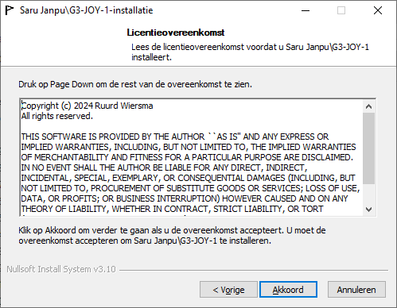
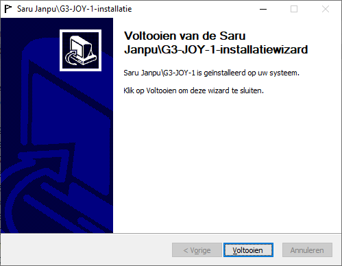
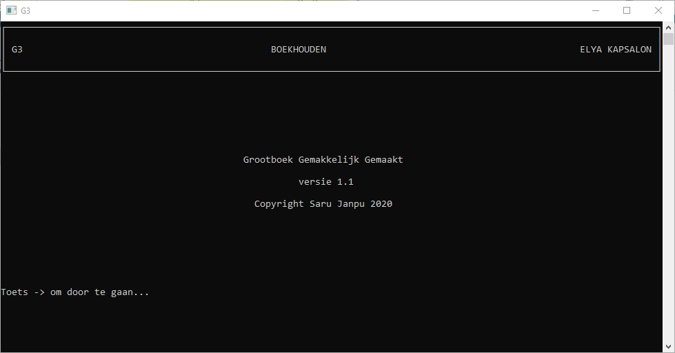
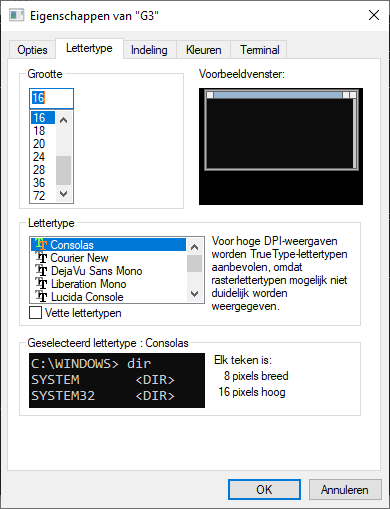
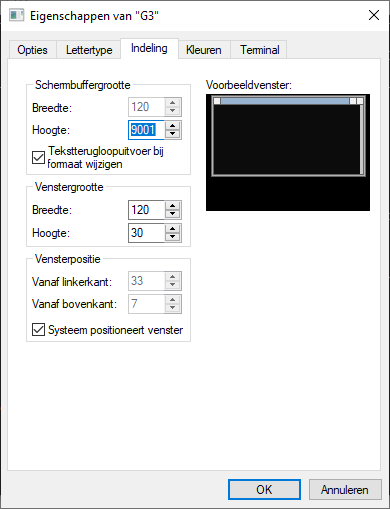
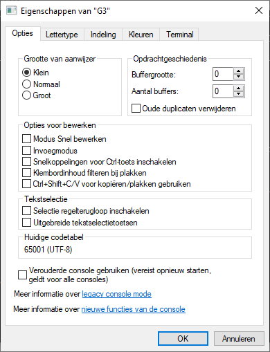
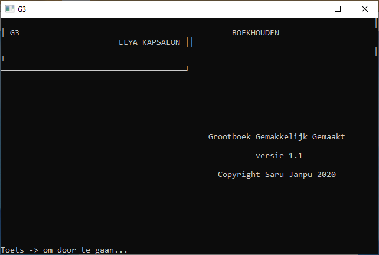
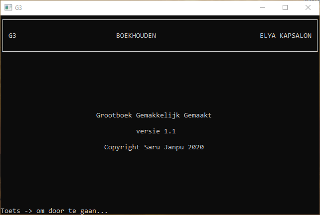

 
==============

Introduction
============

Downloading and compiling the source code of Joy is one way to install the
software on a system. Another way is an installer program, although that one
is available only for Windows.

The installer was created with NSIS. Downloading and installing is still a
frightening experience.

The many steps that are needed are shown in pictures.

Installation
============

The first step is building the joy.exe binary. This can be done in busybox,
using the tiny C compiler. The result is shown in this picture.

 

Instead of the many sections that the gcc compiler generates, this one has
only .text and .data. That is more like Joy. It is a 32-bits binary, usable
on almost all Windows versions. The 64-bits binary had one more section,
containing read-only data.

\pagebreak

As this is a binary for the Windows system, it is possible to add an Icon that
will be displayed here and there. ResourceHacker can be used to add that Icon
and the result is shown here.

 

\pagebreak

The download is supposed to be started from the link on the Github page,
titled G3-JOY-1.

 

\pagebreak

Google does not know how to display the contents. That is ok, the contents of
an .exe file is quite complicated.

 

\pagebreak

The next step is to press the download key and that leads to the following
screen, that says that the .exe is an executable and can harm the computer.

 

\pagebreak

The 'save as' option should be chosen first. This is still harmless, as no
code is executed.

 

\pagebreak

After pressing the 'save as' option, there is another warning, telling that
this particular file is unknown and should only be opened, when trusted.

 

\pagebreak

The way to open it, is to click on the ellipsis next to the message and to
press the 'save' button.

 

\pagebreak

The text warns that an .exe file can be dangerous and downloading should only
be done if the user understands the risks. The only way to proceed is by
pressing the 'more' button.

 

\pagebreak

The 'more' button expands the screen and the way to proceed is by pressing the
'keep' button.

 

\pagebreak

The download is finally going on.

 

\pagebreak

When done, there is the possibility to execute the installer.

 

\pagebreak

Doing that triggers the Microsoft Defender to come into action.

 

\pagebreak

The only way to proceed is by pressing the 'more info' button.
In this screen it becomes possible to trigger the installer.

 

\pagebreak

Before the first screen of the installer, there is a screen
that asks confirmation. Only the administrator of a Windows
PC can do the installation.

 

\pagebreak

The LICENSE is shown. It says that this is Copyrighted software
that comes without warranty.

 

\pagebreak

The installation location is shown. It can probably be modified,
but that has not been tested.

 

\pagebreak

A map is proposed in the start menu where links to the programs
are displayed.

 

\pagebreak

After installing, it does not take long, this screen ends the
installation procedure.

 

\pagebreak

The installer places an icon on the desktop. After starting G3
from that icon the splash screen is shown with standard settings
of the Windows console application.

 

\pagebreak

The standard needs to be modified. This can be done while the G3
program is running. It can also be done in the shortcut itself.
The properties page shows 5 tabs and a lot of checkboxes.

 

\pagebreak

The font selection and size of the font can be adjusted, if so desired.
The font settings as they are seem ok.

 

\pagebreak

The 9001 in this picture is way too large. And the screen width and height
need to be changed into 80x25, because that is what the program was designed
for.

 

\pagebreak

The first tab again with all checkboxes cleared. Buffersize and number of
buffers is set to 0. This will be changed to 1 by the system. The codetable
65001 was set by the application. It is not visible when the desktop shortcut
is modified without starting G3.

 

\pagebreak

As can be seen here, the screen size is set to 80x25. That is what G3 uses and
needs.

 

\pagebreak

This is the effect when the application is running. It probably receives a
redraw message from Windows, but G3 is not listening to Windows. It wants to
tell Windows what should be done, not the other way around. The only solution
is to restart the program and that can be realized by first pressing the right
arrow key.

 

\pagebreak

And then the left arrow key. This ends the screen and also the application.
As can be seen the texts are in Dutch, because the Windows version is also
Ducth. On a Windows in any other language, the English translation file will
be installed in the working directory.

 

\pagebreak

After restarting the application, everything should look normal.

 

Conclusion
==========

Because of the many difficulties with installing from a download link,
the advice is to just download the sources, install a C compiler and
continue from there.

Compilation with tcc means that the makefile needs to be adjusted:
tcc instead of gcc and the -lm in the linker flags can be removed.
